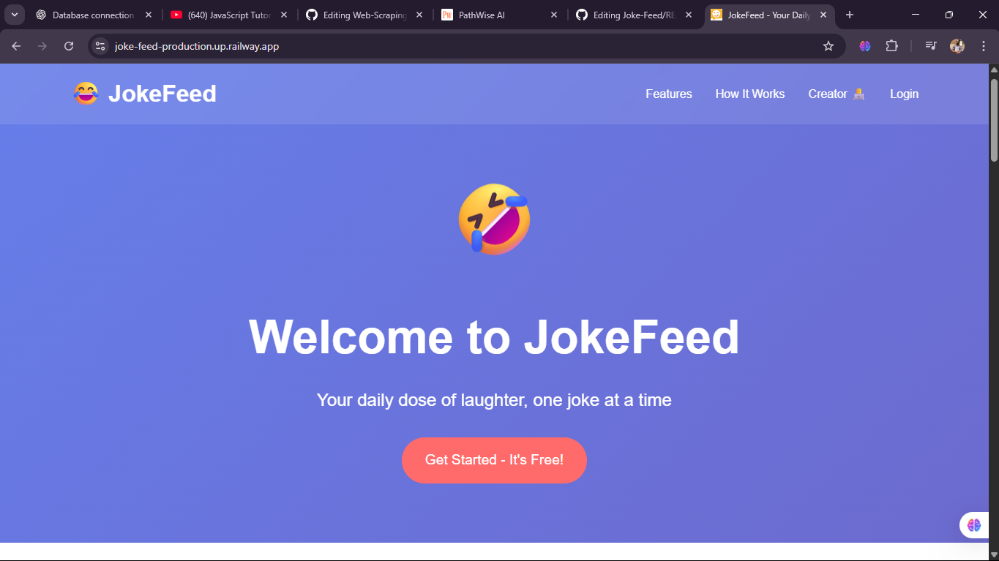
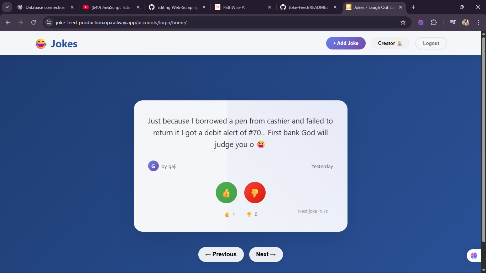

# 🎭 JokeFeed - A TikTok-Style Jokes Platform

  

**JokeFeed** is a modern web application that I Built under 48 hours. It delivers jokes in a TikTok-style interface - one joke at a time, with smooth transitions, voting capabilities, and auto-advance features.

## 🌟 Features

- 📱 **TikTok-Style Interface**: Jokes display one at a time with smooth transitions
- ⏱️ **Auto-Advance**: Jokes automatically change every 7 seconds
- 🎮 **Manual Navigation**: Arrow keys, spacebar, and navigation buttons
- 👍 **Voting System**: Upvote/downvote jokes with real-time count updates
- ✍️ **Add Your Own**: Users can contribute their own jokes
- 🔐 **User Authentication**: Secure signup/login system with token-based auth
- 📱 **Responsive Design**: Works on both desktop and mobile devices

## 🚀 Live Demo

[https://joke-feed-production.up.railway.app/]

## 📸 Screenshots

*
*

---

## 🛠️ The Development Journey

This project was a rollercoaster of learning, debugging, and breakthrough moments. Here's the real story of how JokeFeed came to life:

### Phase 1: Setting Up The Foundation 🏗️

**The Challenge**: Getting Django and DRF properly configured
- Set up Django project with proper settings
- Configured Django REST Framework
- Created virtual environment and installed dependencies
- Set up static files and templates

**Struggles Faced**:
- Initial confusion with Django project structure
- Getting static files to serve correctly
- Understanding the difference between Django views and DRF views

**Breakthrough**: Finally understanding Django's MTV (Model-Template-View) pattern and how DRF extends it.

### Phase 2: Database Design & Models 📊

**The Challenge**: Designing a voting system that prevents abuse
- Created `JokesModel` for storing jokes
- Designed `TrackVote` model to prevent multiple votes
- Set up relationships between users and jokes

**Struggles Faced**:
```python
# Initial attempt - flawed voting system
class JokesModel(models.Model):
    upvotes = models.IntegerField(default=0)
    downvotes = models.IntegerField(default=0)
    # Users could vote multiple times! 😱
```

**The Solution**:
```python
# Final solution - prevents vote abuse
class TrackVote(models.Model):
    user = models.ForeignKey(User, on_delete=models.CASCADE)
    joke = models.ForeignKey(JokesModel, on_delete=models.CASCADE)
    vote_type = models.CharField(max_length=10, choices=VOTE_TYPES)
    
    class Meta:
        unique_together = ('user', 'joke')  # One vote per user per joke!
```

**Breakthrough**: Understanding database relationships and constraints to enforce business logic.

### Phase 3: Authentication Hell 🔐

**The Challenge**: Implementing secure user authentication
- User registration and login
- Token-based authentication for API calls
- Session management

**Struggles Faced**:
- CSRF token issues with frontend requests
- Authentication vs authorization confusion
- Token storage and management in frontend

**Epic Debugging Session**:
```python
# This line caused HOURS of debugging
permission_classes = [IsAuthenticated]
authentication_classes = [TokenAuthentication]  # This was breaking everything!

# The fix - removing TokenAuthentication class temporarily
permission_classes = [AllowAny]  # For testing
```

**Breakthrough**: Understanding the difference between authentication classes and permission classes, and when to use each.

### Phase 4: Serializer Struggles 📝

**The Challenge**: Converting Django models to JSON properly
- Creating serializers that include all necessary fields
- Handling relationships (showing username instead of user ID)
- Read-only vs writable fields

**Major Bug**:
```python
# This caused jokes to not display properly
class JokesSerializer(serializers.ModelSerializer):
    class Meta:
        model = JokesModel
        fields = ['content', 'upvotes', 'downvotes']  # Missing 'id'!
```

**The Fix**:
```python
class JokesSerializer(serializers.ModelSerializer):
    created_by = serializers.StringRelatedField(read_only=True)
    
    class Meta:
        model = JokesModel
        fields = ['id', 'content', 'upvotes', 'downvotes', 'created_at', 'created_by']
```

**Breakthrough**: Understanding that serializers are the bridge between Django models and JSON APIs.

### Phase 5: Frontend JavaScript Chaos 🌪️

**The Challenge**: Creating a smooth, TikTok-like user experience
- Auto-advancing jokes every 7 seconds
- Smooth transitions and animations
- Real-time vote count updates
- Manual navigation controls

**JavaScript Nightmares**:
```javascript
// This caused undefined errors everywhere
const response = await fetch("/api/jokes/", {  // Wrong URL!
```

**Debugging Sessions**:
- Jokes not displaying (wrong API endpoint)
- Voting not working (authentication issues)
- Timer conflicts (multiple intervals running)
- Vote counts not updating (response handling issues)

**The Voting System Debugging**:
```javascript
// Problem: Vote counts weren't updating
async function vote(type, jokeId) {
    const response = await fetch(`${jokeId}/vote/`, {  // Wrong URL pattern!
```

**Final Working Solution**:
```javascript
async function vote(type, jokeId) {
    const voteType = type === 'up' ? 'upvote' : 'downvote';
    const response = await fetch(`/${jokeId}/${voteType}/`, {  // Correct URL!
```

**Breakthrough**: Understanding URL patterns and how backend routing works with frontend requests.

### Phase 6: The Many=True Disaster 💥

**The Problem**: Jokes stopped displaying after trying to add bulk joke functionality
```python
# This line broke everything
serializer = self.serializer_class(data=data_incoming, many=True)
```

**4 Hours of Debugging Later**:
- Frontend sends single joke object
- `many=True` expects array of jokes
- Serializer validation fails silently
- No jokes get created or displayed

**The Fix**:
```python
# Remove many=True for single joke creation
serializer = self.serializer_class(data=data_incoming)  # Fixed!
```

**Lesson Learned**: Sometimes the simplest bugs cause the biggest headaches.

### Phase 7: URL Routing Confusion 🛣️

**The Challenge**: Setting up clean URL patterns for the API
- Different endpoints for different HTTP methods
- Dynamic URLs with parameters
- Frontend/backend URL mismatches

**Major Debugging Session**:
```
TypeError: VotesView.get() got an unexpected keyword argument 'vote_type'
```

**The Problem**:
```python
# URLs were backwards!
path("<int:joke_id>/<str:vote_type>/", VotesView.as_view(), name="getvotes"),  # GET
path("<int:joke_id>/votes/", VotesView.as_view(), name="postvotes"),          # POST
```

**The Fix**:
```python
# Correct URL patterns
path("<int:joke_id>/<str:vote_type>/", VotesView.as_view(), name="postvotes"),  # POST
path("<int:joke_id>/votes/", VotesView.as_view(), name="getvotes"),            # GET
```

**Breakthrough**: Understanding RESTful URL design and parameter passing.

---

## 💡 Key Learning Moments

### 1. **Authentication Architecture**
Understanding the flow: Frontend stores token → Includes in headers → Backend validates → Grants access

### 2. **Database Relationships**
Learning to use `unique_together` to enforce business logic at the database level

### 3. **API Design**
Separating concerns between HTML-serving views and JSON API endpoints

### 4. **Frontend State Management**
Managing application state with vanilla JavaScript (arrays, timers, DOM updates)

### 5. **Debugging Methodology**
- Console.log everything during development
- Test API endpoints directly in browser
- Use browser dev tools network tab
- Isolate problems by temporarily removing features

---

## 🏗️ Technical Architecture

### Backend (Django + DRF)
```
Models → Serializers → Views → URLs → JSON API
```

### Frontend (Vanilla JavaScript)
```
HTML Template → JavaScript State Management → DOM Manipulation → API Calls
```

### Authentication Flow
```
Signup → Login → Token Storage → API Requests with Token → Protected Resources
```

### Voting System
```
User Click → POST Vote → Update TrackVote → Update Joke Counts → GET Updated Counts → Update UI
```

---

## 🛠️ Installation & Setup

### Prerequisites
- Python 3.8+
- pip
- Git

### Step 1: Clone the Repository
```bash
git clone https://github.com/yourusername/jokefeed.git
cd jokefeed
```

### Step 2: Set Up Virtual Environment
```bash
python -m venv venv

# On Windows
venv\Scripts\activate

# On macOS/Linux
source venv/bin/activate
```

### Step 3: Install Dependencies
```bash
pip install django
pip install djangorestframework
pip install djangorestframework-simplejwt  # If using JWT tokens
```

### Step 4: Set Up Database
```bash
python manage.py makemigrations
python manage.py migrate
```

### Step 5: Create Superuser (Optional)
```bash
python manage.py createsuperuser
```

### Step 6: Run Development Server
```bash
python manage.py runserver
```

Visit `http://127.0.0.1:8000/` to see your app!

---

## 🎮 How to Use

### For Users:
1. **Sign Up**: Create an account at `/signup/`
2. **Log In**: Access your account at `/login/`
3. **View Jokes**: Jokes auto-advance every 7 seconds
4. **Navigate**: Use arrow keys, spacebar, or navigation buttons
5. **Vote**: Click 👍 or 👎 to vote on jokes
6. **Add Jokes**: Click "Add Joke" to contribute your own
7. **Log Out**: Use the logout button when done

### For Developers:
1. **Add Jokes via Django Admin**: Access `/admin/` with superuser account
2. **Use API Directly**: 
   - GET `/Added/` - List all jokes
   - POST `/Added/` - Create new joke
   - GET `/{joke_id}/votes/` - Get vote counts
   - POST `/{joke_id}/{vote_type}/` - Submit vote

---

## 📁 Project Structure

```
jokefeed/
├── jokes/                  # Main Django app
│   ├── models.py          # JokesModel, TrackVote
│   ├── views.py           # API views and HTML views
│   ├── serializers.py     # DRF serializers
│   ├── urls.py            # URL routing
│   └── templates/         # HTML templates
├── static/                # CSS and JavaScript files
├── jokefeed/             # Django project settings
│   ├── settings.py
│   ├── urls.py
│   └── wsgi.py
├── manage.py
└── requirements.txt
```

---

## 🔧 API Endpoints

| Method | Endpoint | Description |
|--------|----------|-------------|
| GET | `/Added/` | Get all jokes |
| POST | `/Added/` | Create new joke |
| GET | `/{joke_id}/votes/` | Get vote counts for joke |
| POST | `/{joke_id}/{vote_type}/` | Vote on joke |
| GET | `/{joke_id}/` | Get specific joke |
| DELETE | `/{joke_id}/` | Delete joke (creator only) |
| POST | `/api/signup/` | Create user account |
| POST | `/api/view/login/` | User login |
| POST | `/api/logout/` | User logout |

---

## 🤝 Contributing

This was a learning project, but contributions are welcome! Feel free to:
- Report bugs
- Suggest new features  
- Submit pull requests
- Share your own jokes!

---

## 📝 Lessons Learned

1. **Start Simple**: Build basic functionality first, then add features
2. **Debug Systematically**: Isolate problems and test one thing at a time
3. **Read Error Messages**: They usually tell you exactly what's wrong
4. **Use Console.log Liberally**: During development, log everything
5. **Test API Endpoints Directly**: Before building frontend, ensure backend works
6. **Authentication is Tricky**: Take time to understand the flow properly
7. **Database Design Matters**: Think about constraints and relationships upfront

---

## 🚀 Future Improvements

- [ ] Add user profiles and avatars
- [ ] Implement joke categories/tags
- [ ] Add social sharing features
- [ ] Create mobile app version
- [ ] Add joke reporting/moderation system
- [ ] Implement joke recommendations
- [ ] Add dark mode theme
- [ ] Create joke analytics dashboard

---

## 👨‍💻 About the Developer

This project was built as a learning experience in full-stack web development. It represents growth in:
- Django and Django REST Framework
- JavaScript DOM manipulation
- API design and integration
- Database modeling
- User authentication systems
- Responsive web design

**Previous Projects**: 4+ Django applications, 5+ Python games, 3+ CLI tools
**Next Goal**: Mastering JavaScript to complement Python skills

---

## 📄 License

This project is open source and available under the [MIT License](LICENSE).

---

## 🙏 Acknowledgments

- Django and DRF documentation
- Stack Overflow community
- YouTube tutorials and coding resources
- All the debuggers who came before us 😅

---

*Built with ❤️ and lots of coffee ☕*
